# Loom System — Architecture Diagram

> 严格基于 `backend/app/` 代码生成，未合成或发明任何组件。

```mermaid
graph TB
    %% ============================================================
    %% Layer 1: API Gateway & Frontend Interface
    %% ============================================================
    subgraph API_LAYER["🌐 API Layer (FastAPI Routers)"]
        direction LR
        R_JOBS["routers/jobs.py<br/>POST /jobs/upload<br/>POST /jobs/start"]
        R_PIPE["routers/pipeline.py<br/>GET /pipeline/sse/{thread_id}<br/>POST /pipeline/approve"]
        R_NOVELS["routers/novels.py<br/>Novel CRUD"]
        R_SETTINGS["routers/settings.py<br/>Provider Config"]
    end

    %% ============================================================
    %% Layer 2: Service Orchestration
    %% ============================================================
    subgraph SERVICE_LAYER["⚙️ Service Layer"]
        direction TB
        ENGINE_SVC["engine_service.py<br/>run_engine_task()<br/>approve_and_continue()<br/>regenerate_scene_asset()"]
        EVT_MGR["EventManager<br/>asyncio.Queue per thread<br/>SSE publish/subscribe"]
    end

    %% ============================================================
    %% Layer 3: LangGraph Brain (Core Engine)
    %% ============================================================
    subgraph LANGGRAPH_BRAIN["🧠 LangGraph StateGraph (engine.py)"]
        direction TB

        START_NODE(("START"))

        subgraph INGESTION["Phase 1: Ingestion"]
            BATCH_NODE["batch_analysis_node<br/>(ParallelAnalyzer)<br/>DeepSeek Batch API"]
        end

        subgraph ORCHESTRATION["Phase 2: Orchestration"]
            SUPER_NODE["supervisor_node<br/>(TaskClassifier.classify)"]
            SUPER_ROUTER{"supervisor_router<br/>Conditional Edge"}
        end

        subgraph GENERATION["Phase 3: Multi-Agent Generation"]
            STORY_NODE["storyboard_node<br/>(StoryboardAgent)<br/>@retry x3 tenacity"]
            IMG_NODE["image_gen_node<br/>(ImageGenerator)<br/>Semaphore + gather"]
            TTS_NODE["tts_gen_node<br/>(TTSGenerator)<br/>asyncio batch"]
            VIDEO_NODE["video_gen_node<br/>(VideoGenerator)<br/>SceneRouter + Semaphore<br/>+ AsyncLimiter 10/min"]
        end

        subgraph HITL["Phase 4: Human-in-the-Loop"]
            HITL_NODE["hitl_approval_node<br/>interrupt_before"]
        end

        subgraph ASSEMBLY_PHASE["Phase 5: Post-Production"]
            ASM_NODE["assembly_node<br/>(FFmpegAssembler)<br/>TimelineBuilder"]
        end

        END_NODE(("END"))

        %% --- Graph Edges (from engine.py) ---
        START_NODE -->|"state: initial LoomState"| BATCH_NODE

        BATCH_NODE -->|"batch_status==completed<br/>data: character_registry"| SUPER_NODE
        BATCH_NODE -->|"batch_status==processing<br/>loop: asyncio.sleep(5)"| BATCH_NODE
        BATCH_NODE -->|"batch_status==failed"| END_NODE

        SUPER_NODE --> SUPER_ROUTER

        SUPER_ROUTER -->|"next_node==storyboard<br/>model: Ollama/Gemini/GPT"| STORY_NODE
        SUPER_ROUTER -->|"next_node==image_gen"| IMG_NODE
        SUPER_ROUTER -->|"next_node==tts_gen"| TTS_NODE
        SUPER_ROUTER -->|"next_node==video_gen"| VIDEO_NODE
        SUPER_ROUTER -->|"next_node==hitl_approval"| HITL_NODE
        SUPER_ROUTER -->|"next_node==END<br/>static-fallback"| END_NODE

        STORY_NODE -->|"should_continue()<br/>error_count > 5 → END"| END_NODE
        STORY_NODE -->|"storyboard empty → retry"| STORY_NODE
        STORY_NODE -->|"storyboard ready<br/>no image_tasks"| IMG_NODE
        STORY_NODE -->|"storyboard ready<br/>no audio_tasks"| TTS_NODE
        STORY_NODE -->|"approval==PENDING"| HITL_NODE
        STORY_NODE -->|"approval==REJECTED<br/>re-generate"| STORY_NODE

        IMG_NODE -->|"state: image_tasks[]"| SUPER_NODE
        TTS_NODE -->|"state: audio_tasks[]"| SUPER_NODE
        HITL_NODE -->|"event: user approval<br/>via aupdate_state"| SUPER_NODE

        VIDEO_NODE -->|"state: video_tasks[]"| ASM_NODE
        ASM_NODE -->|"output: final_video.mp4"| END_NODE
    end

    %% ============================================================
    %% Layer 4: Supervisor Intelligence Detail
    %% ============================================================
    subgraph SUPERVISOR_DETAIL["🎯 Supervisor Intelligence (supervisor.py)"]
        direction TB
        TC["TaskClassifier.classify()<br/>5-level Decision Tree"]
        SR["SceneRouter.route_scene()<br/>SceneProductionStrategy"]

        TC_R1["A: error_count ≥ 5<br/>→ static-fallback END"]
        TC_R2["B: error_count ≥ 3<br/>→ Ollama AI degradation"]
        TC_R3["C: storyboard exists<br/>→ image/tts/hitl/video"]
        TC_R4["D: cost > 80% limit<br/>→ force Ollama"]
        TC_R5["E: text < 500 chars<br/>→ local Ollama"]
        TC_R6["F: default complex<br/>→ cloud Gemini/GPT"]

        TC --- TC_R1
        TC --- TC_R2
        TC --- TC_R3
        TC --- TC_R4
        TC --- TC_R5
        TC --- TC_R6

        SR_H["HIGH importance / action<br/>→ VIDEO_HIGH"]
        SR_L["LOW importance / landscape<br/>→ IMAGE_CINEMATIC"]
        SR --- SR_H
        SR --- SR_L
    end

    %% ============================================================
    %% Layer 5: Persistence & Memory
    %% ============================================================
    subgraph PERSISTENCE["💾 Persistence Layer"]
        direction LR
        CKPT_FACTORY["CheckpointerFactory<br/>(db/checkpointer.py)"]
        SQLITE_DB[("SQLite<br/>WAL Mode<br/>AsyncSqliteSaver")]
        PG_DB[("PostgreSQL<br/>PostgresSaver<br/>(Production)")]
        CKPT_FACTORY -->|"MVP"| SQLITE_DB
        CKPT_FACTORY -->|"Scale"| PG_DB
    end

    subgraph TEMPORAL_RAG["🔍 Temporal RAG Memory (vector_store.py)"]
        direction TB
        VSM["VectorStoreManager<br/>per session_id isolation"]
        CHROMA[("ChromaDB<br/>per-character Collection<br/>char_{md5_hash}")]
        VSM -->|"add_character_trait()<br/>metadata: chapter_idx"| CHROMA
        VSM -->|"get_contextual_profile()<br/>where: chapter ≤ current"| CHROMA
    end

    subgraph ASSET_CACHE["📦 Asset Store (asset_store.py)"]
        direction TB
        AS_MEM["State: asset_manifest<br/>(in-memory Dict)"]
        AS_DISK["Disk: output/.asset_cache/<br/>manifest.json"]
        AS_HASH["SHA-256 Hash<br/>key = hash(prompt+style+type)"]
        AS_HASH --> AS_MEM
        AS_HASH --> AS_DISK
    end

    %% ============================================================
    %% Layer 6: External Provider Registry
    %% ============================================================
    subgraph PROVIDERS["☁️ Provider Registry (providers/base.py)"]
        direction LR
        PR["ProviderRegistry<br/>Factory Pattern"]
        IP["ImageProvider<br/>(ABC)"]
        TP["TTSProvider<br/>(ABC)"]
        VP["VideoProvider<br/>(ABC)"]
        MOCK["MockProvider<br/>(providers/mock.py)"]
        PR --> IP
        PR --> TP
        PR --> VP
        IP --> MOCK
        TP --> MOCK
        VP --> MOCK
    end

    subgraph EXTERNAL_APIS["🌍 External APIs"]
        direction LR
        KLING["Kling 3.0<br/>Video Gen"]
        DEEPSEEK["DeepSeek<br/>Batch Analysis"]
        GEMINI["Google Gemini<br/>Storyboard LLM"]
        OLLAMA["Ollama (Local)<br/>Fallback LLM"]
        OPENAI_API["OpenAI<br/>DALL-E 3 / TTS-1-HD"]
    end

    %% ============================================================
    %% Layer 7: Resilience Modules
    %% ============================================================
    subgraph RESILIENCE["🛡️ Resilience (modules/)"]
        direction LR
        CG["cost_guard.py<br/>CostLimitExceededError<br/>Real-time Circuit Breaker"]
        TLB["timeline_builder.py<br/>Dynamic Timeline<br/>ffprobe duration priority"]
        FFM["ffmpeg_tools.py<br/>FFmpegAssembler<br/>Ken Burns + Normalize"]
    end

    %% ============================================================
    %% Cross-Layer Connections
    %% ============================================================

    %% API → Service
    R_JOBS -->|"POST: novel_content + config"| ENGINE_SVC
    R_PIPE -->|"SSE stream subscribe"| EVT_MGR
    R_PIPE -->|"POST: approve"| ENGINE_SVC

    %% Service → LangGraph
    ENGINE_SVC -->|"loom_app.astream()<br/>initial_state + config"| START_NODE
    ENGINE_SVC -->|"aupdate_state(approval)"| HITL_NODE
    EVT_MGR -.->|"async publish per node"| ENGINE_SVC

    %% LangGraph ↔ Persistence
    LANGGRAPH_BRAIN -->|"auto-snapshot after<br/>each node execution"| CKPT_FACTORY
    CKPT_FACTORY -->|"restore state<br/>by thread_id"| LANGGRAPH_BRAIN

    %% Storyboard → RAG
    STORY_NODE -->|"get_contextual_profile()<br/>chapter_index filter"| VSM

    %% Batch → RAG write
    BATCH_NODE -->|"add_character_trait()<br/>per chapter"| VSM

    %% Generation → Providers
    IMG_NODE -->|"ProviderRegistry<br/>.get_image_provider()"| PR
    TTS_NODE -->|"ProviderRegistry<br/>.get_tts_provider()"| PR
    VIDEO_NODE -->|"ProviderRegistry<br/>.get_video_provider()"| PR

    %% Provider → External APIs
    IP -.->|"generate(prompt)"| OPENAI_API
    TP -.->|"synthesize(text)"| OPENAI_API
    VP -.->|"image_to_video()"| KLING
    BATCH_NODE -.->|"Batch API call"| DEEPSEEK
    STORY_NODE -.->|"LLM invoke"| GEMINI
    STORY_NODE -.->|"fallback invoke"| OLLAMA

    %% Generation → Asset Cache
    IMG_NODE -->|"get/save_cached_asset()<br/>SHA-256 dedup"| AS_HASH
    VIDEO_NODE -->|"get/save_cached_asset()"| AS_HASH

    %% Cost Guard integration
    IMG_NODE -->|"update_and_check_cost()"| CG
    TTS_NODE -->|"update_and_check_cost()"| CG
    VIDEO_NODE -->|"update_and_check_cost()"| CG
    STORY_NODE -->|"update_and_check_cost()"| CG

    %% Assembly
    ASM_NODE -->|"TimelineBuilder.build()"| TLB
    ASM_NODE -->|"FFmpegAssembler.assemble()"| FFM

    %% Supervisor detail connection
    SUPER_NODE -.->|"uses"| TC
    VIDEO_NODE -.->|"per-scene routing"| SR

    %% ============================================================
    %% Styling
    %% ============================================================
    classDef apiStyle fill:#4A90D9,stroke:#2C5F8A,color:#fff,stroke-width:2px
    classDef serviceStyle fill:#7B68EE,stroke:#5A4CB5,color:#fff,stroke-width:2px
    classDef nodeStyle fill:#2ECC71,stroke:#1A9850,color:#fff,stroke-width:2px
    classDef hitlStyle fill:#F39C12,stroke:#D68910,color:#fff,stroke-width:2px
    classDef persistStyle fill:#8E44AD,stroke:#6C3483,color:#fff,stroke-width:2px
    classDef providerStyle fill:#E74C3C,stroke:#C0392B,color:#fff,stroke-width:2px
    classDef resilStyle fill:#1ABC9C,stroke:#16A085,color:#fff,stroke-width:2px
    classDef decisionStyle fill:#F4D03F,stroke:#D4AC0D,color:#333,stroke-width:2px

    class R_JOBS,R_PIPE,R_NOVELS,R_SETTINGS apiStyle
    class ENGINE_SVC,EVT_MGR serviceStyle
    class BATCH_NODE,STORY_NODE,IMG_NODE,TTS_NODE,VIDEO_NODE,ASM_NODE nodeStyle
    class HITL_NODE hitlStyle
    class CKPT_FACTORY,SQLITE_DB,PG_DB,CHROMA,VSM,AS_MEM,AS_DISK,AS_HASH persistStyle
    class PR,IP,TP,VP,MOCK,KLING,DEEPSEEK,GEMINI,OLLAMA,OPENAI_API providerStyle
    class CG,TLB,FFM resilStyle
    class SUPER_NODE,SUPER_ROUTER,TC,SR,TC_R1,TC_R2,TC_R3,TC_R4,TC_R5,TC_R6,SR_H,SR_L decisionStyle
```

## Code-to-Diagram Traceability

| Diagram Component | Source File | Key Lines |
|---|---|---|
| StateGraph definition | `core/engine.py` | L399-465 |
| supervisor_node + supervisor_router | `core/engine.py` | L92-151 |
| TaskClassifier 5-level decision tree | `core/supervisor.py` | L78-194 |
| SceneRouter per-scene strategy | `core/supervisor.py` | L43-68 |
| LoomState TypedDict + Reducers | `core/state.py` | L42-135 |
| CheckpointerFactory (SQLite/PG) | `db/checkpointer.py` | L23-113 |
| Temporal RAG (chapter filter) | `modules/vector_store.py` | L81-110 |
| Asset Store (SHA-256 dedup) | `modules/asset_store.py` | L45-95 |
| Cost Guard circuit breaker | `modules/cost_guard.py` | L12-34 |
| VideoGenerator (Semaphore + aiolimiter) | `agents/video/generator.py` | L51-212 |
| StoryboardAgent (Pydantic + retry) | `agents/story/storyboard.py` | L126-238 |
| TimelineBuilder (ffprobe priority) | `modules/timeline_builder.py` | L28-136 |
| FFmpegAssembler (normalize + Ken Burns) | `modules/ffmpeg_tools.py` | full file |
| ProviderRegistry (ABC factory) | `providers/base.py` | L63-98 |
| EventManager (SSE pub/sub) | `services/engine_service.py` | L16-45 |
| run_engine_task (astream loop) | `services/engine_service.py` | L49-79 |
