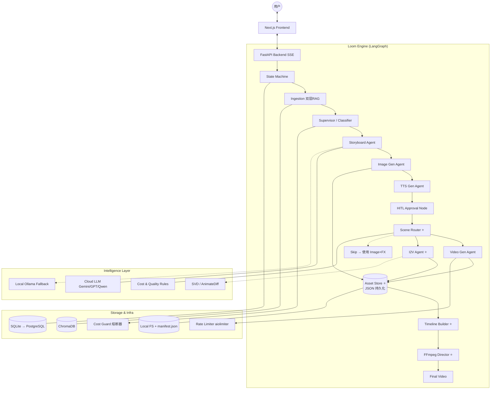
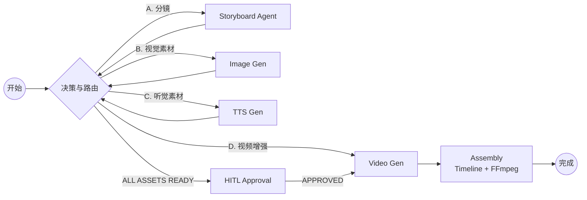

# 织影系统 (Loom System) - 混合架构 (v2.1)

本文档描述了截至目前的系统全链路架构（审计修复后）。

## 1. 系统概论图 (System Overview)

## 2. 核心工作流拓扑 (Core Workflow)

## 3. 核心机制 (v2.1 更新)

### 3.1 智能场景路由器 (Scene Router) ⭐
- **分级生产**：根据分镜 `importance` 和 `type` 自动决策
- **四级策略**：VIDEO_HIGH / VIDEO_SIMPLE / IMAGE_CINEMATIC / MOCK

### 3.2 资产中间层 (Asset Store) ⭐
- **SHA-256 Hashing**：`hash(prompt + style + type) -> asset_path`
- **双层缓存**：内存 State + 磁盘 `manifest.json` 持久化
- **跨任务复用**：进程重启后缓存不丢失

### 3.3 时间轴构建器 (Timeline Builder) ⭐ *New*
- **音频驱动**：通过 ffprobe 获取 TTS 音频实际时长
- **多源 fallback**：音频时长 > 分镜指定 > 默认 5s
- **精确对位**：计算每段的绝对起止时间

### 3.4 I2V Agent ⭐ *New*
- **AI 动画化**：将静态关键帧转化为短视频 (SVD / AnimateDiff)
- **与 Ken Burns 互补**：Ken Burns 做几何变换，I2V 做 AI 运动生成

### 3.5 导演合成系统 (FFmpeg Director) ⭐
- **镜头语言**：Zoom/Pan (Ken Burns) + 视频归一化 (`_normalize_clip`)
- **多轨合成**：旁白 + BGM + 字幕一次性合成
- **降级保护**：失败后自动切换为图片轮播

## 4. 生产梯度

| 场景级别 | 生成方式 | 预期质量 | 成本权重 |
| :--- | :--- | :--- | :--- |
| **视觉高光** | Kling 3.0 / I2V | 电影级动态 | ★★★★★ |
| **动作/转场** | 国内视频模型 | 基础动态 | ★★★ |
| **叙事/背景** | 图片 + Zoom/Pan | 静态美学 + 镜头感 | ★ |
| **对话场景** | 图片 + 精准旁白 | 广播剧视听 | ★ |

