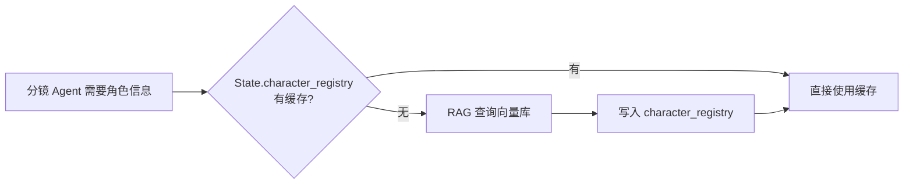

# 织影系统 (Loom System) - 详细设计

## 1. 微服务模块详细职责

### 1.1 Ingestion Service (知识抽取)

*   **职责**：文本清洗、智能分片、角色档案构建。
*   **双层分片策略**：
    *   **粗切层（章节级）**：按章节自然分界拆分，每个 Chunk 保留章节标头作为元数据。
    *   **细切层（角色实体级）**：NER 提取角色名称后，为每个角色建立**独立的向量集合** (Collection)，存储所有涉及该角色外貌、性格、服装的文本片段。
*   **向量库方案**：
    *   MVP：ChromaDB（本地轻量，零运维）。
    *   生产：Milvus 集群（支撑百万级向量检索）。

### 1.2 Supervisor Agent (协调器)

*   **Task Classifier (路由决策)**：
    ```python
    def classify_task(task: LoomTask) -> RoutingDecision:
        if task.text_length < 500 and not task.has_character_desc:
            return RoutingDecision(model="ollama/qwen2.5", reason="简单文本摘要")
        elif task.requires_visual_generation:
            return RoutingDecision(model="kling-3.0", reason="视觉场景生成")
        else:
            return RoutingDecision(model="deepseek-chat", reason="复杂剧本分析")
    ```
*   **循环自省**：若分镜 Agent 输出的 JSON 未通过 Pydantic 校验，Supervisor 自动触发重写循环（最多 3 次），超出后降级至简化模板。
*   **成本熔断**：每次 API 调用后累加 `cost_accumulator`，达到阈值时挂起整个管线并通知用户。

### 1.2 路由内核 (Supervisor & SceneRouter) ⭐

在 v2.0 中，路由逻辑被解构为两层：
1.  **任务级路由 (TaskClassifier)**：负责全流程阶段控制（分镜->素材->审批->视频->合成）。
2.  **场景级路由 (SceneRouter)**：负责根据分镜元数据（Importance, Type）决定某个片段是生成视频还是使用动效关键帧。

#### 路由决策矩阵 (包含阻断与降噪)：
- **Kling (High)**: `importance` == "high" OR `type` == "action"
- **Static + FX (Low)**: `importance` == "low" OR `type` == "landscape"
- **HITL Storyboard (阻断)**: 剧本结构生成完毕后，触发 `ApprovalStatus.STORYBOARD_PENDING`，强制系统暂停生图生成，以防止高额 Token 和图像渲染费因为剧本崩坏而浪费。
- **状态机降噪 (State Pruning)**: 在分镜生成被确认后，系统自动清空 `novel_content`（释放数万字），使得此后的 API 调用成本直降 90%。

---

### 1.3 资产中间层 (Asset Store) ⭐

**设计理念**：素材文件不与特定任务 ID 绑定，而是与内容哈希绑定。

- **SHA-256 Hashing**: `hash(description + visual_style + asset_type)`。
- **缓存检查**: Generator 启动前先调用 `get_cached_asset()`。
- **双层持久化**: 内存 `LoomState["asset_manifest"]` + 磁盘 `output/.asset_cache/manifest.json`。
- **进程重启安全**: JSON 文件确保缓存跨会话存活。

---

### 1.4 导演系统 (FFmpeg Director) ⭐

**合成演进**：从单纯的 `concat` 升级为具有镜头感知的后期系统。

- **Ken Burns 效果**: 使用 `zoompan` 滤镜，为 `Image` 类型素材注入缓慢的相机移动（缩放倍率从 1.0 到 1.1）。
- **时间轴驱动**: 基于分镜 `duration` 和 TTS 音频长度自动计算片段边界。
- **自动对位**: 支持背景 BGM 与多轨旁白的自动混缩。
*   **输入标准化 (Pydantic 模型)**：
    ```python
    class VideoSegment(BaseModel):
        segment_id: str
        file_path: str               # 视频片段本地路径
        resolution: str = "1920x1080" # 目标分辨率
        fps: int = 30                 # 目标帧率
        codec: str = "h264"           # 编码格式
        subtitle_text: Optional[str] = None
        subtitle_start_ms: Optional[int] = None
        subtitle_end_ms: Optional[int] = None
    ```
*   **格式归一化**：合成前自动检测每个片段的分辨率/帧率/编码，不一致时先执行 `ffmpeg -vf scale=... -r ...` 统一格式。
*   **字幕时间轴对齐**：基于各片段的累积时长自动计算字幕的绝对时间偏移。
*   **错误回退**：磁盘满/内存溢出时，自动清理临时文件并重试；连续失败后降级为仅导出图片轮播版本。

### 1.5 二次创作引流层 (JianYing Exporter) ⭐ *New*

**剪映协作引擎** (`jianying_exporter.py`)：为解决纯代码合成无法满足细粒度特效微调的问题。
- **草稿生成**: 将 Timeline 事件逐帧翻译为剪映原生的 `draft_info.json`。
- **零丢失编排**: 生成 `.zip` 包，保留多轨对齐结构（背景乐、旁白、视频层解耦独立）。
- **用户自由度**: 实现自动化出毛坯、剪映出精装。

### 1.5 时间轴构建器 (Timeline Builder) ⭐ *New*

**设计理念**：替代硬编码的 5.0s duration，实现基于音频时长的动态时间轴。

- **优先级规则**: TTS 实际时长 (ffprobe) > 分镜 duration_seconds > 默认 5s
- **精确对位**: 每段的绝对起止时间自动计算
- **索引化检索**: 自动匹配 image/video/audio 任务结果

### 1.6 I2V Agent (Image-to-Video) ⭐ *New*

**与 FFmpeg Ken Burns 的区别**：
- **Ken Burns**: 纯几何变换 (缩放/平移)，无 AI 生成
- **I2V**: AI 驱动的运动生成，可产生物体运动、表情变化等

支持模型:
- SVD (Stable Video Diffusion)
- AnimateDiff
- ComfyUI + ControlNet

## 2. 全局状态 (State) 定义

```python
from typing import TypedDict, Optional
from enum import Enum

class ApprovalStatus(str, Enum):
    PENDING = "pending"
    APPROVED = "approved"
    REJECTED = "rejected"

class LoomState(TypedDict):
    # === 核心标识 ===
    session_id: str                   # 租户/任务唯一标识
    thread_id: str                    # 线程标识
    chapter_index: int                # 当前处理章节索引

    # === 文本与记忆 ===
    novel_content: str
    global_context: Annotated[Dict, reduce_dict]
    character_registry: Annotated[Dict, reduce_dict]

    # === 分镜产出 ===
    storyboard_json: Annotated[List, reduce_list]

    # === HITL 控制 ===
    approval_status: str
    approval_feedback: Optional[str]

    # === 素材任务 ===
    video_tasks: Annotated[List, reduce_list]
    image_tasks: Annotated[List, reduce_list]
    audio_tasks: Annotated[List, reduce_list]

    # === 成本与韧性 ===
    cost_accumulator: Annotated[float, reduce_cost]
    cost_limit: float
    error_count: Annotated[int, reduce_error_count]
    retry_history: Annotated[List, reduce_list]
    generation_mode: str

    # === 执行追踪 ===
    execution_logs: Annotated[List, reduce_list]
    scene_metadata: Annotated[Dict, reduce_dict]

    # === 路由决策缓存 ===
    _routing_model_provider: Optional[str]
    _routing_model_name: Optional[str]
    _routing_next_node: Optional[str]  # v2.1: 避免 router 重复计算

    # === 资产清单 ===
    asset_manifest: Annotated[Dict, reduce_dict]  # hash -> {path, type, ts}

## 3. 结构化输出保证

*   **Pydantic + Function Calling**：分镜 Agent 强制输出经过 Pydantic 校验的 JSON。
*   **校验失败自愈**：Pydantic ValidationError 被 Supervisor 捕获后，携带错误信息重新调用分镜 Agent（循环自省，最多 3 轮）。
*   **降级兜底**：3 轮自省仍失败时，使用预定义的简化分镜模板填充，保证管线不中断。

## 4. 角色记忆缓存策略



*   **首次查询**：从 ChromaDB/Milvus 检索角色描述，写入 `character_registry`。
*   **角色面部锁定 (Character Bible Anchoring)**：系统并在生成过程通过视觉大模型提取出 `reference_image_url`，此后所有该角色的出场生图，全部携带底图 URL，从而解决 "换镜跳脸" 严重视觉崩坏问题。
*   **后续引用**：同一任务（session）内直接从 State 缓存读取，零延迟且保证一致性。
*   **手动刷新**：HITL 节点中，可视化的角色控制面板允许用户审阅并修改角色特征图及描述设定。
