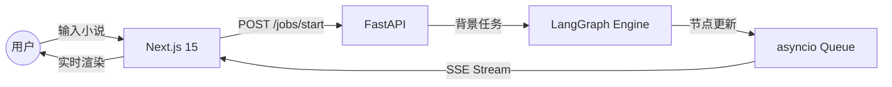

# Loom (织影) 2.0: 全栈前后端分离架构设计

## 1. 架构演进背景
V1.0 版本基于 Streamlit 单体架构，虽然开发迅速，但在处理 LangGraph 复杂的异步状态、人机交互（HITL）以及长耗时视频生成任务时存在响应瓶颈。V2.0 转向了工业级的现代全栈架构。

## 2. 技术栈 (2026 推荐组合)
- **后端 (Backend)**: FastAPI + LangGraph + SSE (Server-Sent Events)
- **前端 (Frontend)**: Next.js 15 (App Router) + Tailwind CSS + shadcn/ui
- **持久化**: SQLite (支持多 Thread Checkpointer)
- **容器化**: Docker Compose (一键编排)

## 3. 核心分层设计

### 3.1 Backend (Loom-API)
- **main.py**: 入口文件，负责 FastAPI 生命周期管理、CORS 配置。
- **SSE 事件总线**: 采用 `asyncio.Queue` 实现，实时推送 LangGraph 节点事件（如 `ingestion` -> `storyboard`）。
- **Core Engine**: 基于迁移后的 `backend/app/core` 逻辑。

### 3.2 Frontend (Loom-Dashboard)
- **Dashboard**: 主控中心，集成了小说摄取和历史任务管理。
- **Real-time monitor**: 基于 SSE 自动侦听后端进度，动态更新工作流视图。
- **HITL Editor**: 专门的分镜审批页，支持卡片式预览与状态反馈。

## 4. 数据流图


## 5. 部署参考
项目支持一键容器化：
```bash
docker-compose up --build
```
- 后端 API: 8000 端口
- 前端 Dashboard: 3000 端口
